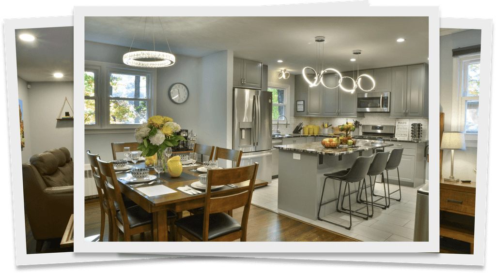

# Image Guide - Greenwood Lake Getaway

## ✅ Images Successfully Added!

All your original images have been copied to `assets/images/` and are ready to use.

---

## 📸 Your Images (31 photos + logo)

### Logo
- **`logo.svg`** - Your original Greenwood Lake Getaway logo (41KB)
  - ✅ Already updated in HTML (favicon and social media)

### Hero/Featured Image
- **`hero-image.jpeg`** - Front of house (626KB)
  - ✅ Already set as social media preview image

### Living Room (4 photos)
- `01-living-room-large.jpeg` (171KB)
- `01.1-the-house---lr-large.jpeg` (206KB)
- `01.2-the-house---lr-large.jpeg` (224KB)
- `01.3-the-house---lr-large.jpeg` (219KB)

### Master Bedroom & Bath (5 photos)
- `02-the-house---master-large.jpeg` (223KB)
- `02.1-the-house---master-large.jpeg` (194KB)
- `02.2-the-house---master-large.jpeg` (233KB)
- `02.3-the-house---master-bath-large.jpeg` (192KB)
- `02.4-the-house---master-bath-large.jpeg` (186KB)

### Dining & Kitchen (3 photos)
- `03-the-house---dining_kitchen-large.jpeg` (246KB)
- `03.1-the-house---dining-large.jpeg` (202KB)
- `03.2-the-house---kitchen-large.jpeg` (254KB)

### Queen Bedroom (2 photos)
- `4-the-house---queen-large.jpeg` (202KB)
- `4.1-the-house---queen-large.jpeg` (185KB)

### Twins Bedroom (2 photos)
- `6-the-house---twins-large.jpeg` (191KB)
- `6.1-the-house---twins-large.jpeg` (162KB)

### Bathrooms
- `5-the-house---2nd-bathroom-large.jpeg` (174KB)

### Utility Spaces
- `7-the-house---mud-room-large.jpeg` (176KB)

### Exterior - Front (4 photos)
- `20-the-house---entrance-large.jpeg` (434KB)
- `20.1-front-of-the-house-large.jpeg` (626KB) ← **Used as hero image**
- `20.2-front-large.jpeg` (565KB)
- `9-porch-large.jpeg` (374KB)
- `9.1-front-porch2.jpeg` (539KB)
- `9.2-front-porch1.jpeg` (536KB)

### Outdoor Amenities (6 photos)
- `8-the-house---bbq-large.jpeg` (273KB)
- `21-smoker-large.jpeg` (307KB)
- `22-hammock-large.jpeg` (716KB)
- `23-the-house---patio-large.jpeg` (354KB)
- `23.1-the-house---patio-large.jpeg` (426KB)
- `23.2-the-house---patio-large.jpeg` (524KB)

### Lake View
- `24-lake-large.jpeg` (369KB)

---

## 🎯 What's Already Updated

✅ **Logo** - Your SVG logo is now used for:
- Browser favicon (tab icon)
- Social media sharing

✅ **Hero Image** - Front of house photo is now used for:
- Open Graph (Facebook, LinkedIn)
- Twitter Card preview

---

## 📝 How to Add More Images to Your Website

The Framer-generated HTML is complex, but here's how you can add images:

### Option 1: Replace Existing Images in Framer Structure
Find image references in `index.html` and replace the URLs with your new images:

```html
<!-- Find something like this: -->


<!-- Replace with your image: -->

```

### Option 2: Create a Photo Gallery Section
I can help you add a new photo gallery section to showcase all your images. This would require:
1. Adding HTML for a gallery grid
2. Adding CSS for styling
3. Optional: JavaScript for lightbox/modal viewing

---

## 🖼️ Image Recommendations

### For Best Performance
Your images are quite large (some over 500KB). Consider:

1. **Compress images** to reduce file size:
   - Use online tools like TinyJPG or Squoosh
   - Target: 100-200KB per image

2. **Convert to WebP format** for better compression:
   - WebP is 25-35% smaller than JPEG
   - Modern browsers support it

3. **Create thumbnails** for gallery views:
   - Small versions (200x150px) for grid display
   - Full size loads when clicked

### Suggested Image Sizes
- **Hero/Featured**: 1920x1080px (max 300KB)
- **Gallery thumbnails**: 400x300px (max 50KB)
- **Full gallery images**: 1200x900px (max 200KB)
- **Logo**: SVG (already perfect!)

---

## 🚀 Next Steps

### Current Status
✅ All images copied to `assets/images/`  
✅ Logo updated in HTML  
✅ Hero image set for social media  
⏳ Gallery images ready to use (need to add to HTML)

### Options

**Option A: Keep Current Site**
- Your site works perfectly as-is
- Logo and hero image are updated
- Other photos are available but not displayed

**Option B: Add Photo Gallery**
- I can help you add a gallery section
- Display all 31 photos in a grid
- Add lightbox for full-size viewing
- Requires modifying the HTML

**Option C: Replace Specific Images**
- Tell me which images in the current site to replace
- I'll find them in the HTML and swap them out

---

## 📊 Image Inventory

**Total Images**: 31 photos + 1 logo  
**Total Size**: ~10.5 MB  
**Location**: `assets/images/`  
**Status**: ✅ Ready to use

---

## 💡 Want to Add a Gallery?

If you'd like to showcase all these beautiful photos on your website, let me know and I can:

1. Add a "Gallery" or "Photos" section
2. Create a responsive grid layout
3. Add click-to-enlarge functionality
4. Organize photos by room/area

Just say "add photo gallery" and I'll get started!

---

*All your original images are preserved in `Website Images/` folder*
